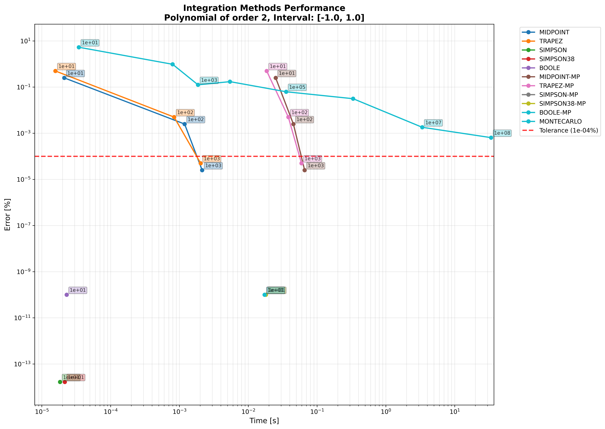

# Polynomial Integration CLI

A Python CLI tool for polynomial operations and numerical integration with visualization and performance analysis.

## Features

- Polynomial operations: add, subtract, multiply, and display polynomials
- Multiple numerical integration methods including Newton-Cotes and Monte Carlo
- Multiprocessing support for improved performance
- Adaptive integration with automatic refinement
- Performance visualization and convergence plots
- Save integration results to JSON
- Rich terminal interface with progress tracking

## Installation

### From Pre-built Wheel (Recommended)

Download the latest wheel from the [releases page](https://github.com/swanckel93/polynomial_integration/releases) and install e.g. for release v0.1.0:
```bash
pip install polynomials-0.1.0-py3-none-any.whl
```

**Note for Externally Managed Environments**: If you're on Ubuntu/Debian or similar systems with externally managed Python environments, create a virtual environment first:

```bash
# Create a virtual environment in your current directory
python3 -m venv venv

# Activate it
source venv/bin/activate

# Install the wheel
pip install polynomials-0.1.0-py3-none-any.whl

# When done, deactivate with:
# deactivate
```

### From Source

Or build from source:

```bash
# Install Poetry if needed
curl -sSL https://install.python-poetry.org | python3 -

# Install dependencies and build
poetry install
poetry build

# Install the built wheel (replace with actual filename from dist/)
pip install dist/*.whl
```
## Usage

```bash
# Display a polynomial
poly display "1 2 3"  # Represents 1 + 2x + 3x²

# Add polynomials
poly add "1 2" "0 1 3"  # (1 + 2x) + (x + 3x²)

# Integrate with tolerance
poly integrate "1 0 -1" 0 2 --tolerance 1e-6 --save-data

# Generate performance plots
poly plot your_integration_results.json
```

## Integration Methods

Available solvers:

- **MIDPOINT**, **TRAPEZ**, **SIMPSON**, **SIMPSON38**, **BOOLE** - Newton-Cotes methods
- **MIDPOINT_MP**, **TRAPEZ_MP**, **SIMPSON_MP**, **SIMPSON38_MP**, **BOOLE_MP** - Parallel versions
- **MONTECARLO** - Monte Carlo sampling

## Commands

### Integration

```bash
poly integrate [COEFFICIENTS] [INTERVAL_A] [INTERVAL_B] [OPTIONS]
```

Options:
- `--solver, -s`: Specify solvers (can use multiple times)
- `--tolerance`: Integration tolerance (default: 1e-6)
- `--timeout`: Timeout per solver in seconds (default: 30)
- `--start-n`: Initial subintervals/samples (default: 10)
- `--seed`: Random seed for Monte Carlo (default: 42)
- `--batch-size`: Batch size for multiprocess solvers (default: 1024)
- `--save-data`: Save results to JSON file

### Other Commands

```bash
poly display "coefficients"           # Display polynomial
poly add "coeffs1" "coeffs2"         # Add polynomials
poly subtract "coeffs1" "coeffs2"    # Subtract polynomials
poly multiply "coeffs1" "coeffs2"    # Multiply polynomials
poly plot [JSON_FILENAME]            # Generate plots
poly list-runs                       # List saved runs
```

## Examples

The `examples/` directory contains sample scripts:

### Short Integration Example
```bash
./examples/integration_short.sh
```

This integrates `f(x) = 1 + x²` over `[-1, 1]` with tolerance `1e-4`:



### Long Integration Example  
```bash
./examples/integration_long.sh
```

This integrates `f(x) = 1 + 3x² + 5x³ + 7x⁴ + 9x⁵ + 9x⁶ - 200x⁷ - 40x⁸ - 25x⁹ + 9x¹⁰` over `[-128, 128]` with tolerance `1e-11`:


### Other Examples
```bash
./examples/add.sh                    # Polynomial addition
./examples/subtract.sh               # Polynomial subtraction
./examples/multiply.sh               # Polynomial multiplication
```

## Requirements

- Python 3.8+
- typer, rich, numpy, matplotlib, seaborn, strenum

Development dependencies: pytest, poetry

## Project Structure

```
src/polynomials/      # Core polynomial and solver logic
src/helpers/          # CLI helpers and utilities
examples/             # Example scripts and sample data
tests/                # Unit and integration tests
data/                 # Saved integration results
plots/                # Generated visualizations
dist/                 # Built packages
```

## Development

Format code:
```bash
poetry run black .
```

Run tests:
```bash
poetry run pytest              # All tests
poetry run pytest -m unit      # Unit tests only
poetry run pytest -m integration  # Integration tests only
```

Build:
```bash
poetry build
```

## Contributing

1. Fork the repository
2. Create a feature branch
3. Make changes and add tests
4. Run tests and format code
5. Submit a pull request

## License

MIT License - see LICENSE file for details.