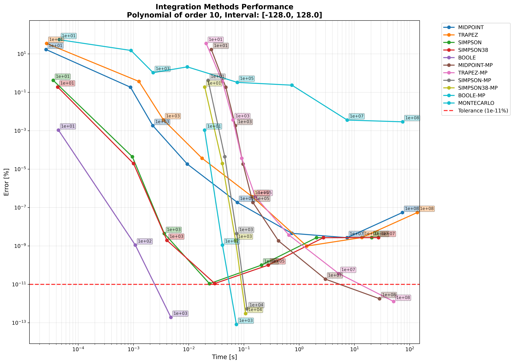

# 🧮 Polynomial Integration CLI

A powerful Python CLI tool for polynomial operations and numerical integration with beautiful visualization and performance analysis.

## ✨ Features

- **Polynomial Operations**: Add, subtract, multiply, and display polynomials with beautiful formatting
- **Multiple Integration Methods**: 11+ numerical integration solvers including Newton-Cotes methods and Monte Carlo
- **Multiprocessing Support**: Parallel processing for improved performance on large computations
- **Adaptive Integration**: Automatic refinement until tolerance is met or timeout occurs
- **Performance Visualization**: Generate plots comparing solver performance and convergence
- **Data Persistence**: Save integration results to JSON for later analysis
- **Rich CLI Interface**: Beautiful terminal output with progress tracking and formatted results

## 🚀 Quick Start

### Installation

The package is available as a pre-built wheel. Install directly from the `dist/` directory:

```bash
pip install dist/polynomials-0.1.0-py3-none-any.whl
```

Or build from source using Poetry:

```bash
# Install Poetry if you haven't already
curl -sSL https://install.python-poetry.org | python3 -

# Install dependencies and build
poetry install
poetry build

# Install the built wheel
pip install dist/polynomials-0.1.0-py3-none-any.whl
```

### Basic Usage

```bash
# Display a polynomial
poly display "1 2 3"  # Represents 1 + 2x + 3x²

# Add two polynomials
poly add "1 2" "0 1 3"  # (1 + 2x) + (x + 3x²)

# Integrate a polynomial
poly integrate "1 0 -1" 0 2 --tolerance 1e-6 --save-data

# Create performance plots
poly plot your_integration_results.json
```

## 📊 Integration Methods

| Method | Description | Type |
|--------|-------------|------|
| `MIDPOINT` | Midpoint rule | Newton-Cotes |
| `TRAPEZ` | Trapezoidal rule | Newton-Cotes |
| `SIMPSON` | Simpson's 1/3 rule | Newton-Cotes |
| `SIMPSON38` | Simpson's 3/8 rule | Newton-Cotes |
| `BOOLE` | Boole's rule | Newton-Cotes |
| `MIDPOINT_MP` | Parallel midpoint rule | Multiprocessing |
| `TRAPEZ_MP` | Parallel trapezoidal rule | Multiprocessing |
| `SIMPSON_MP` | Parallel Simpson's rule | Multiprocessing |
| `SIMPSON38_MP` | Parallel Simpson's 3/8 rule | Multiprocessing |
| `BOOLE_MP` | Parallel Boole's rule | Multiprocessing |
| `MONTECARLO` | Monte Carlo sampling | Stochastic |

## 📖 CLI Commands

### Integration Command

```bash
poly integrate [COEFFICIENTS] [INTERVAL_A] [INTERVAL_B] [OPTIONS]
```

**Options:**
- `--solver, -s`: Specify solvers to use (can use multiple times)
- `--tolerance`: Integration tolerance (default: 1e-6)
- `--timeout`: Timeout per solver in seconds (default: 30)
- `--start-n`: Initial subintervals/samples (default: 10)
- `--seed`: Random seed for Monte Carlo (default: 42)
- `--batch-size`: Batch size for multiprocess solvers (default: 1024)
- `--save-data`: Save results to JSON file in `./data/`

### Plotting Command

```bash
poly plot [JSON_FILENAME] [OPTIONS]
```

**Options:**
- `--output, -o`: Output plot path (default: `./plots/`)

### Other Commands

```bash
# Display polynomial
poly display "coefficients"

# Polynomial arithmetic
poly add "coeffs1" "coeffs2"
poly subtract "coeffs1" "coeffs2"  
poly multiply "coeffs1" "coeffs2"

# List saved integration runs
poly list-runs
```

## 🎯 Examples

Check out the `examples/` directory for sample scripts:

### Short Integration Example
```bash
# Run a quick integration comparison
./examples/integration_short.sh
```

This integrates `f(x) = 1 + x²` over `[-1, 1]` with tolerance `1e-4`:


*Performance comparison showing error vs time for different solvers on a simple polynomial*

### Long Integration Example  
```bash
# Run a comprehensive integration analysis
./examples/integration_long.sh
```

This integrates `f(x) = 1 + 3x² + 5x³ + 7x⁴ + 9x⁵ + 9x⁶ - 200x⁷ - 40x⁸ - 25x⁹ + 9x¹⁰` over `[-128, 128]` with tolerance `1e-11`:


*Detailed convergence analysis showing how different methods approach the tolerance threshold*

### Other Examples
```bash
./examples/add.sh        # Polynomial addition
./examples/subtract.sh   # Polynomial subtraction  
./examples/multiply.sh   # Polynomial multiplication
./examples/display.sh    # Polynomial display
```

## 📦 Dependencies

- **Python 3.8+**
- **Core Dependencies:**
  - `typer`: CLI framework
  - `rich`: Beautiful terminal output
  - `numpy`: Numerical computations
  - `matplotlib`: Plotting
  - `seaborn`: Enhanced plotting styles
  - `strenum`: String enumerations
- **Development Dependencies:**
  - `pytest`: Testing framework
  - `poetry`: Dependency management and packaging

## 🏗️ Project Structure

```
├── src/
│   ├── polynomials/          # Core polynomial and solver logic
│   └── helpers/              # CLI helpers and utilities
├── examples/                 # Example scripts and sample data
├── tests/                    # Unit and integration tests  
├── data/                     # Saved integration results
├── plots/                    # Generated visualizations
└── dist/                     # Built wheel packages
```

## 🔧 Development

### Code Quality
This project uses `black` for code formatting. Run it before committing:
```bash
poetry run black .
```

### Running Tests
We use pytest with custom markers for different test categories:
```bash
# Run all tests
poetry run pytest

# Run only unit tests
poetry run pytest -m unit

# Run only integration tests
poetry run pytest -m integration
```

### Building Package
```bash
poetry build
# Or use the convenience script
./rebuild_wheel.sh
```

### Installing Development Version
```bash
poetry install
poetry run poly --help
```

## 📈 Future Improvements

- **Enhanced Error Analysis**: Add different error metrics beyond relative error
- **Solver Performance Metrics**: Plot error/time vs sample count for convergence analysis  
- **Expanded Solver Suite**: Add more numerical methods and parallel Monte Carlo
- **Non-Polynomial Support**: Extend to arbitrary functions with symbolic integration
- **Verbose Mode**: Add flag to control partial result printing
- **Precision Options**: Support for higher precision arithmetic (np.float64)
- **Enhanced CLI**: Add progress bars and running timers
- **Filtering Options**: Add flag to plot only solvers within tolerance
- **Dynamic Parameter Optimization**: Improve kwargs forwarding in adaptive refinement

## 🤝 Contributing

1. Fork the repository
2. Create a feature branch (`git checkout -b feature/amazing-feature`)
3. Make your changes and add tests
4. Run the test suite (`poetry run pytest`)
5. Format your code (`poetry run black .`)
6. Commit your changes (`git commit -m 'Add amazing feature'`)
7. Push to the branch (`git push origin feature/amazing-feature`)
8. Open a Pull Request

## 📄 License

This project is licensed under the MIT License - see the LICENSE file for details.

## 🎉 Acknowledgments

- Built with modern Python tooling (Poetry, Typer, Rich)
- Inspired by numerical analysis and scientific computing principles
- Designed for both educational use and practical numerical integration tasks